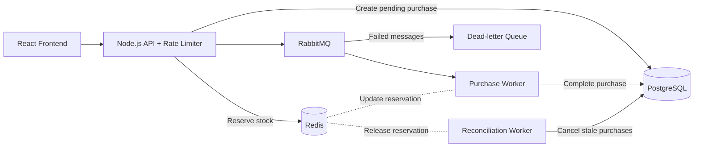

# Flash Sale

A flash-sale application with a TypeScript/Express backend, React frontend, PostgreSQL, Redis, and RabbitMQ.

## Prerequisites

- Node.js
- pnpm `8.10.2` or compatible
- Docker Desktop with Docker Compose

## Run From the Root

All commands below should be run from the repository root.

1. Install dependencies:

   ```sh
   pnpm install
   ```

2. Start PostgreSQL, Redis, RabbitMQ, and the background workers:

   ```sh
   pnpm docker:up
   ```

3. Run the database migrations:

   ```sh
   pnpm db:migrate
   ```

4. Start the backend in one terminal:

   ```sh
   pnpm backend
   ```

   The API runs at `http://localhost:3000`.

5. Start the frontend in a second terminal:

   ```sh
   pnpm frontend
   ```

   Open the local URL printed by Vite, usually `http://localhost:5173`.

The frontend proxies `/api` requests to the backend. The backend uses the Docker services configured in `docker-compose.yml` by default.

## Tests and Checks

Run backend unit tests:

```sh
pnpm test
```

Run integration tests after starting the Docker services and applying migrations:

```sh
pnpm test:integration:setup
```

## Architecture Diagram



The API returns `202 Accepted` after submitting a purchase for processing. The frontend polls for its final status. The purchase flow below explains transaction locking, retries, and reservation handling.

### Components and Responsibilities

| Component                | Responsibility                                                                                                                                                                                                                                                                                                                                                                                                                                                                          |
| ------------------------ | --------------------------------------------------------------------------------------------------------------------------------------------------------------------------------------------------------------------------------------------------------------------------------------------------------------------------------------------------------------------------------------------------------------------------------------------------------------------------------------- |
| React frontend           | Submits purchases and polls transaction status every three seconds because purchase completion is asynchronous.                                                                                                                                                                                                                                                                                                                                                                         |
| Gateway / rate limiter   | Redis-backed, per-IP rate limiting implemented as Express middleware. No load balancer for this assignment because stress tests revealed that the first main bottleneck is the DB.                                                                                                                                                                                                                                                                                                      |
| Node.js purchase service | Reserves stock in Redis, creates a pending transaction in PostgreSQL, and publishes the purchase to RabbitMQ. Immediate acceptance of HTTP request without waiting for purchase completion.                                                                                                                                                                                                                                                                                             |
| Redis                    | Fast-admission control layer. Uses an atomic Lua script to quickly check sale eligibility, buyer/idempotency state, and available stock, then decrement stock and record the reservation. This lets invalid purchase requests be quickly rejected without ever hitting the DB. Now stock management becomes more complicated, but the system will be performant.                                                                                                                        |
| RabbitMQ                 | Buffers accepted purchases in the durable `purchase.process` queue. Allows us to control the rate of requests coming in to the DB. The tradeoff is now we need a separate reconciliation worker to account for potential failed messages or unexpected RabbitMQ failures that leave a transaction stuck in pending. Another tradeoff is user experience: users cannot immediately know their transaction status and must poll or something to find out what happened to their requests. |
| PostgreSQL               | Relational database since we have a bunch of relational data models. Stores transaction status and product stock. Unique constraints, seralized stock updates, and transaction row locking ensure correctness, will always ensure system correctness as the "last line of defense".                                                                                                                                                                                                     |
| Dead-letter queue        | Receives rejected messages through `purchase.process.dlx` into `purchase.process.dlq` for failure visibility.                                                                                                                                                                                                                                                                                                                                                                           |
| Reconciliation worker    | It is highly possible that some transactions get stuck in PENDING because of some failure mode (RabbitMQ failing to publish message, DB timeout, etc.). We use a periodic job to cancel any PENDING transactions stuck in PENDING for > 10 minutes to release the stuck stock.                                                                                                                                                                                                          |

### Purchase Flow

1. The frontend submits a purchase request with a buyer, product, and idempotency key.
2. Rate-limit middleware checks the request before it reaches the purchase service. The configured limit is deliberately high for stress testing.
3. Redis atomically checks the sale window, buyer state, and stock. A valid request decrements Redis stock and creates pending buyer/reservation markers.
4. The API creates a `PENDING` transaction in PostgreSQL and sends its ID and purchase input to RabbitMQ. It returns HTTP `202 Accepted`; this means queued for processing, not completed.
5. The consumer locks the transaction row with `FOR UPDATE`. A `COMPLETED` transaction is treated as already processed; a `CANCELLED` transaction is rejected. Otherwise, it decrements database stock and marks the transaction `COMPLETED` in the same database transaction.
6. After the database commit, the service attempts to mark the Redis reservation as completed, and the consumer acknowledges the message. The frontend discovers the final status through polling.

### High Throughput & Scalability

1. Using Redis, we can quickly accept and reject transactions without ever hitting Postgres.
2. Using RabbitMQ, we can tune prefetch and number of consumers to match DB apacity.
3. No load balancer was used in this assignment since we are able to quickly process HTTP requests, but this is definitely easily implementable if the servers start becoming the bottleneck.

### Robustness & Fault Tolerance

1. Separate reconciliation worker created to ensure stock integrity in case of RabbitMQ failures or other failures
2. RabbitMQ controls the rate of which Postgres receives requests. This ensures Postgres does not receive requests beyond its capacity.
3. Database fallback in case Redis is down. However do note, that it is not configured for complete atomicity like Redis to make it at least a bit more performant. The down side is that excess requests might go through and the database will have to reject them later on
4. Retries are configured for retryable errors
5. Release stock if DB transaction rolls back

### Concurrency Control

1. Unique constraints in Postgres are used ensure our core requirements. (e.g. no transactions for same idempotency key, no user can make more than one purchase for the same product)
2. Row lock to prevent retries from potentially deducting stock twice
3. Robust Lua script in Redis to ensure that only valid purchase requests go through.

### Stress Test

## Results

The tests were done with:
10s ramp-up
5s spike
20s sustained load
5s ramp-down

The number of virtual users and stock are proportional to the test profiles: light, medium or heavy.

Admission throughput is the rate at which HTTP requests were accepted and queued; completion throughput is the rate at which purchases were completed in PostgreSQL.

## Analysis

### Prefetch: 0

Selected metrics from the latest three runs. Times are in seconds, rates are per second, memory is in MB, and CPU values are percentages.

| Run | Profile | Avg accepted/s | P99 admit | Avg DB completion/s | P95 completion | P99 completion | Node CPU avg | Node CPU peak | Node memory avg | Node memory peak | Redis CPU avg | Redis memory avg | P95 pool acquire | P95 row lock wait |
| --- | ------- | -------------: | --------: | ------------------: | -------------: | -------------: | -----------: | ------------: | --------------: | ---------------: | ------------: | ---------------: | ---------------: | ----------------: |
| 1   | light   |        2,343.9 |     0.250 |               538.5 |         48.634 |         48.928 |          40% |           88% |             141 |              218 |           20% |      25.98 MiB\* |            1.409 |             0.074 |
| 2   | light   |        1,783.9 |     0.312 |               530.3 |         45.829 |         46.045 |          37% |           82% |             132 |              196 |           19% |      22.02 MiB\* |           27.907 |             0.101 |
| 3   | medium  |        1,987.3 |     0.694 |               555.6 |         50.698 |         51.037 |          30% |           74% |             158 |              305 |           19% |       24.2 MiB\* |           37.468 |             0.089 |

\* These three historical rows contain only the last Redis memory sample. New runs record the true average Redis memory for the test.
