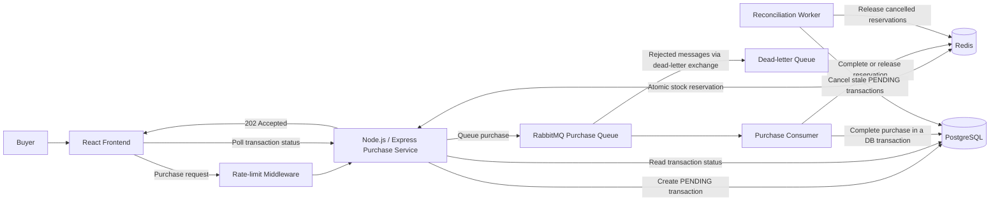

# Flash Sale

A flash-sale application with a TypeScript/Express backend, React frontend, PostgreSQL, Redis, and RabbitMQ.

## Prerequisites

- Node.js
- pnpm `8.10.2` or compatible
- Docker Desktop with Docker Compose

## Run From the Root

All commands below should be run from the repository root.

1. Install dependencies:

   ```sh
   pnpm install
   ```

2. Start PostgreSQL, Redis, RabbitMQ, and the background workers:

   ```sh
   pnpm docker:up
   ```

3. Run the database migrations:

   ```sh
   pnpm db:migrate
   ```

4. Start the backend in one terminal:

   ```sh
   pnpm backend
   ```

   The API runs at `http://localhost:3000`.

5. Start the frontend in a second terminal:

   ```sh
   pnpm frontend
   ```

   Open the local URL printed by Vite, usually `http://localhost:5173`.

The frontend proxies `/api` requests to the backend. The backend uses the Docker services configured in `docker-compose.yml` by default.

## Tests and Checks

Run backend unit tests:

```sh
pnpm test
```

Run integration tests after starting the Docker services and applying migrations:

```sh
pnpm test:integration:setup
```

## Architecture Diagram



### Components and Responsibilities

| Component | Responsibility |
| --- | --- |
| React frontend | Submits purchases and polls transaction status every three seconds because purchase completion is asynchronous. |
| Gateway / rate limiter | Redis-backed, per-IP rate limiting implemented as Express middleware. The current deployment has no separate gateway service or load balancer. |
| Node.js purchase service | Reserves stock in Redis, creates a pending transaction in PostgreSQL, and publishes the purchase to RabbitMQ. Returns acceptance without waiting for purchase completion. |
| Redis | Uses an atomic Lua script to check sale eligibility, buyer/idempotency state, and available stock, then decrement stock and record the reservation. This lets invalid purchase requests be rejected before creating a database transaction record. |
| RabbitMQ | Buffers accepted purchases in the durable `purchase.process` queue. Consumer prefetch controls the number of unacknowledged messages delivered to the worker. |
| Purchase consumer | Processes queued purchases, retries recognized transient errors, and commits the stock decrement and purchase completion together in PostgreSQL. |
| PostgreSQL | Stores transaction status and product stock. Row locking and status checks prevent cancelled purchases from completing and completed purchases from decrementing stock again. |
| Dead-letter queue | Receives rejected messages through `purchase.process.dlx` into `purchase.process.dlq` for failure visibility. |
| Reconciliation worker | Runs every minute and attempts to cancel pending transactions older than five minutes, then releases their Redis reservations if cancellation succeeds. |

### Purchase Flow

1. The frontend submits a purchase request with a buyer, product, and idempotency key.
2. Rate-limit middleware checks the request before it reaches the purchase service. The configured limit is deliberately high for stress testing.
3. Redis atomically checks the sale window, buyer state, and stock. A valid request decrements Redis stock and creates pending buyer/reservation markers.
4. The API creates a `PENDING` transaction in PostgreSQL and sends its ID and purchase input to RabbitMQ. It returns HTTP `202 Accepted`; this means queued for processing, not completed.
5. The consumer locks the transaction row with `FOR UPDATE`. A `COMPLETED` transaction is treated as already processed; a `CANCELLED` transaction is rejected. Otherwise, it decrements database stock and marks the transaction `COMPLETED` in the same database transaction.
6. After the database commit, the service attempts to mark the Redis reservation as completed, and the consumer acknowledges the message. The frontend discovers the final status through polling.

### Failure Handling and Reconciliation

The consumer makes up to three attempts for recognized transient PostgreSQL and network errors, using exponential backoff with jitter. If processing fails, it attempts to cancel the pending purchase and rejects the message without requeueing it, sending it to the dead-letter queue. Definitive database rollbacks also trigger an attempt to release the Redis reservation; uncertain database outcomes are logged for reconciliation.

Reconciliation handles stale pending transactions, including those left behind by publication or worker failures. Cancellation updates only transactions still marked `PENDING`, and stock release is attempted only when that update succeeds. Completion holds a row lock while checking status and updating database stock, so completion and cancellation cannot both succeed for the same purchase. A delayed consumer cannot complete a purchase that reconciliation has already cancelled.

Redis stock release is atomic and checks that the reservation belongs to the matching pending request before incrementing stock and removing its markers.

### Throughput and Deployment

The design uses Redis for fast reservation and rejection, then RabbitMQ to buffer bursts before purchase completion writes reach PostgreSQL. Worker prefetch is configured through `PURCHASE_WORKER_PREFETCH`; a positive value bounds outstanding messages per worker, while `0` means unlimited. Because the consumer starts each delivered message asynchronously and acknowledges it after processing, a positive prefetch value also bounds concurrent purchase processing in that worker. Multiple worker instances increase aggregate concurrency.

The current deployment omits a load balancer. The design rationale is that stress testing identified the database as the primary bottleneck, so the queue and worker settings target database pressure. Accepted requests still create pending transaction rows synchronously; the queue buffers the subsequent purchase completion work.

### Current Implementation Limits

- Redis pending buyer and reservation markers expire after two minutes, but reconciliation cancels transactions older than five minutes. Since release requires those markers to exist, reconciliation can cancel an old transaction without restoring its Redis stock. Marker expiry itself does not increment stock.
- Cancellation and Redis stock release are separate operations. If release fails after cancellation, subsequent reconciliation scans of pending transactions will not retry that cancelled transaction.
- Publication uses persistent messages on a regular RabbitMQ channel without publisher confirms. HTTP acceptance is not a broker-confirmed delivery guarantee.
